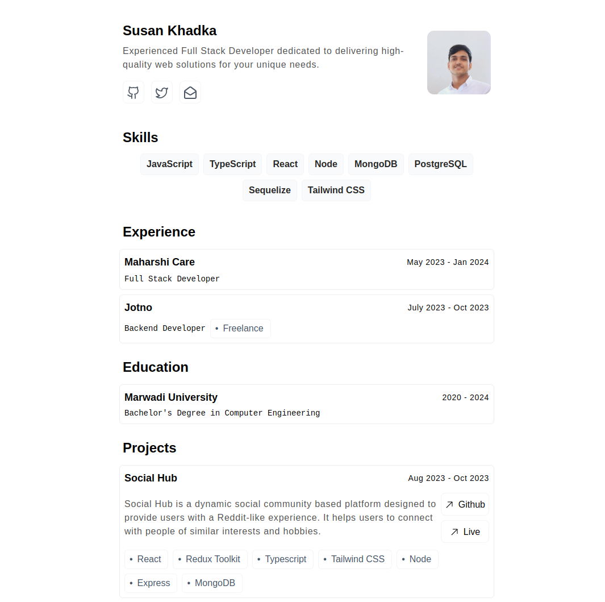

# OpenCV
OpenCV is acts as a template if anyone want to quickly setup a cv/portfolio website. It has been developed by inspiring from [Bartosz Jarocki](https://cv.jarocki.me/) cv website. [Github Link](https://github.com/bartoszjarocki/cv).

It is built using React with Typescript.

## Getting Started Locally

To get started with OpenCV, follow these simple steps:

1. Clone the repository:  `git clone https://github.com/codexsusan/OpenCV`
2. Change directory to OpenCV: `cd OpenCV`
3. Install the required dependencies: `npm install`
4. Start the server: `npm run dev`
5. Open your browser and access OpenCV at `http://localhost:5173`
6. You can update your info in `user-data.json` file inside `src` folder. 
7. After all you are free to alter the components and use it if you can.

## Support

If you encounter any issues or need assistance with OpenCV, feel free to [create an issue](https://github.com/codexsusan/OpenCV/issues). We will do our best to address the problems and provide timely support.

Thanks for checking out.